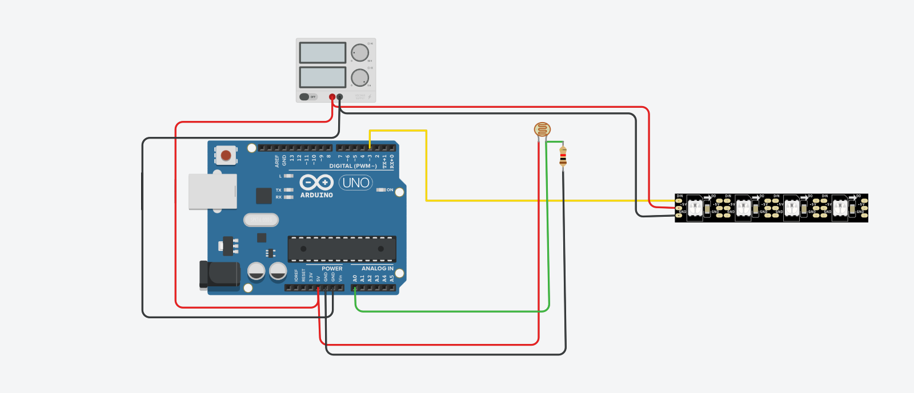
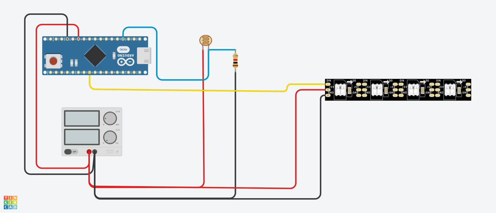

 
# Under Cabinet Lighting
## _Fun and easy project_ 

This is a simple and low cost under cabinet light solution.  Nothing to touch or
turn on..it's automatic!!! 

- Works dusk to dawn
- User must adjust to fit needs
- ✨Magic ✨

## Features

- Once built find a suitable light spot
- adjust map() function to fit your lighting conditions
- built, test and install! 
  
## Tech

Uses easy to get materials:

- [Arduino IDE](https://www.arduino.cc/en/software) - Free!
- [LDR](https://www.amazon.com/gp/product/B00RLGFIEY/ref=ppx_yo_dt_b_asin_title_o03_s00?ie=UTF8&psc=1) - LDR (You can use any LDR)
- [Diffusers](https://www.amazon.com/gp/product/B01M09PBYX/ref=ppx_yo_dt_b_asin_title_o02_s01?ie=UTF8&psc=1) - Amazon
- [WS2812B](https://www.amazon.com/gp/product/B0888H7QLG/ref=ppx_yo_dt_b_asin_title_o02_s02?ie=UTF8&psc=1) - WS2812B String LEDs.
- [Arduino](https://www.amazon.com/gp/product/B07G99NNXL/ref=ppx_yo_dt_b_asin_title_o05_s00?ie=UTF8&psc=1) - Works with UNO or NANO [Original or Clone]
- [Project Box](https://stlbase.com/browse/project+box+enclosure/) - Find one you like, 3d Print -- I included one.  It's just the right size if using an UNO.
- [Project Box 2](https://www.amazon.com/Zulkit-Waterproof-Dustproof-Electrical-Electronic/dp/B09JYQ528P/ref=sr_1_9?crid=1UANSP5J77RFZ&keywords=project+box&qid=1644580114&sprefix=project+box%2Caps%2C98&sr=8-9) - OR buy a project box!
- [Resister](https://www.amazon.com/Projects-100EP51210K0-10k-Resistors-Pack/dp/B0185FIOTA/ref=sr_1_12?crid=1F7YUAZ0YUIVO&keywords=110k+resistor&qid=1644580167&sprefix=110k+resister%2Caps%2C85&sr=8-12) - Resister recommend! 
- [Power Supply](https://www.amazon.com/Aclorol-Switching-Universal-Transformer-Converter/dp/B07KC55TJF/ref=sr_1_6?crid=2LU5AXS4XQHQG&keywords=5v+20+amp+power+supply&qid=1645702026&s=electronics&sprefix=5v+20+amp+power+supply%2Celectronics%2C102&sr=1-6) - Buy a 5v supply OR you may have one laying around already!  But just remember to buy one that will be enough!  See below to figure that out!
- [Bread Boards](https://www.amazon.com/Pcs-MCIGICM-Points-Solderless-Breadboard/dp/B07PCJP9DY/ref=sr_1_6?crid=1P2P2O8J2T55R&keywords=bread+board&qid=1644581526&s=industrial&sprefix=bread+board%2Cindustrial%2C94&sr=1-6) Bread Board for testing if you'd like
 
## Installation
>1. Decide what you're using.  Uno or NANO either way the instructions are the same [except choosing board and port to program on]
>2. Grab the ino from here and look inside.  You'll need to change a few things!
    > How many led's your using
    > Look at the line "ldrValue = map(ldr, 0, 735, 70, 0);"  Run it as is then adjust as needed
>3. Test.. Hook up wiring as shown in picture.
>4. Once happy with results begin your perm. install

## Map Function
    
>value: the number to map.  [ldrValue] 
>fromLow: the lower bound of the value’s current range. [0] - ldrValue 
>fromHigh: the upper bound of the value’s current range. [1023] - ldrValue 
>toLow: the lower bound of the value’s target range. [70] -LED Brightness 
>toHigh: the upper bound of the value’s target range. [0] - LED Brihtness 
            
So this says basically when there is no light fromLow 0 - show led brightness at 70 toLow 
                                        light ranging from 1 to 1023 ldrValue fromHigh show lights from 0 up to max brightness 70 toHigh 
It does the calulations for you to determine the lights brightness :)

## Under cabinet

You can use the diffusers or not either way it doesn't matter [I used them because I had them]
You can install diffusers or stick led's directly to under cabinet.  

## 5v or 12v?

I use 5v for most my projects for one simple reason.... they do not get hot.  12v can get hot,
the wiring can get hot.  Just proceed and please be careful.  Also remember that if using 12v 
your wiring will be different and you'll need a 'buck' converter to get down to 5v.  You'll
have to do the math and figure that all out yourself :).  
 
## Power Supply
 
Which one do I need?  Well lets do some simple math [we'll do mine since I don't know yours :)].
Each led light uses about 50mA - 55mA [milliamps].  I have 142 [142 X 55] lights so I am using [I'm using the 55mA] 
7810mA which converts to 7.8Amps or round up ... 8 amps.   NOW figuring my microcontroller uses 2.4 mA... 
that's 0.0024Amps.   Do some adding...that means I need a power supply that supplies 8.0024Amps.   
When doing this you also need to figure in 15 to 20% more amps just in case... which leads me to needing at 
min a 5v 10Amp power supply.  I would suggest you get a 5v 15A or 5v 20A.  The reason I didn't use a brick
power supply is because there is no adjust for voltage where the metal box variety does have a voltage
adjustment on them! 

## Issues
I did run into a couple small problems.
Too much light made the LEDS show at max brightness so playing with the map function is going
to be a case by case basis.  [I combated this by adding an if statement that should take care of
that problem on 2/21/22]. Perhaps you may run into issues with either the code or placement.  
For code issues there's plenty of help right on this forum [Arduino Forum](https://forum.arduino.cc/).  
Again VERY helpful and great people there.  I'm new to writing Sketches for projects but once you 
do a couple it's pretty straight forward.  The other problem occurs during the beginning of sunrise.
The ligths will occassinally 'flicker' a bit, for me not too bad and livable but when you run into a 
there's light but just not enough by a bit this will happen. I haven't worked on this yet but may
in the future.  Remember I'm not trying to create a retail product here.... just making some lights
for my kitchen  and sharing what I've done :).

BUT then if you really want something to work you'll find a way... I did.  ;) Special Thanks to kgray9 
for the sketch AND all the help!!  

One issue I have found is that early in the morning before the light really comes in the windows it may
flash a bit here and there.   Needs adjustment to map function.  You will have to play with it until it
works in the location you have it set.   

## Development
Want to contribute? Great!
I'd like to see other variations of this!  Maybe color, etc.
I am running mine with a sonos zigbee plug to turn the power on and off through [Home Assistant](https://www.home-assistant.io/)
Great program for running your entire house on automation.   Why did I choose to do this way?
So it wouldn't be powered on while the sun was out, I simply have an automation that after the sun sets the power goes on until the sun comes up again!   You can find many great examples of how to do this on the [Home Assistant forum](https://community.home-assistant.io/). 

Great community and VERY helpful to new people!

## What if I don't use or even want Home Assistant?

That's okay... like I said you don't need it!  It'll work whether you use Home Assistant or not!

## Note about included Project box 
   
   I used my soldering iron to put holes where needed.  The box was just a straight box with a lid.   It all worked out perfectly!

## License

MIT
**Free Software, Hell Yeah!**

With Uno [You can put a resistor in between the D3 pin and light strip, it will smooth things out.]

With Nano [You can put a resistor in between the D3 pin and light strip, it will smooth things out.]

## Test

 
